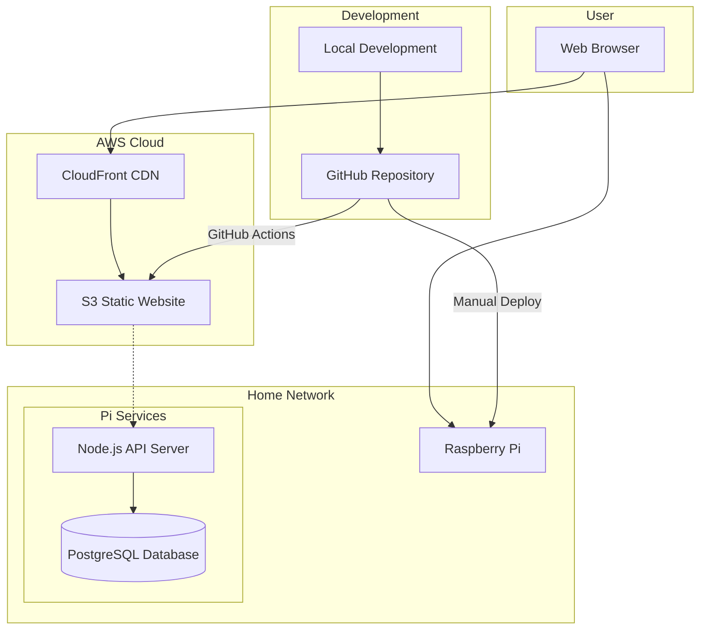

# Portfolio Project Architecture Plan

## Project Overview

A minimal portfolio website with a React frontend, Node.js/Prisma backend, and PostgreSQL database. The project features a welcome page and a simple blog with CRUD operations.

## 1. Current Project Analysis

### Existing Setup

- **Project Name**: react-prisma-pg1
- **Backend**: Basic Node.js setup with minimal package.json
- **Current State**: Very early stage with only basic package.json structure
- **Missing Components**: Frontend structure, database setup, API implementation, deployment configuration

### Assessment

The project is in its initial phase with only a basic backend package.json file. A complete architecture and implementation plan is needed.

## 2. Recommended Project Structure

```
fullstack-portfolio-project/
├── README.md
├── ARCHITECTURE.md
├── .gitignore
├── docker-compose.yml (for local development)
├── .github/
│   └── workflows/
│       ├── frontend-deploy.yml
│       └── backend-deploy.yml
├── frontend/
│   ├── public/
│   │   ├── index.html
│   │   ├── favicon.ico
│   │   └── manifest.json
│   ├── src/
│   │   ├── components/
│   │   │   ├── common/
│   │   │   │   ├── Header.jsx
│   │   │   │   ├── Footer.jsx
│   │   │   │   └── Navigation.jsx
│   │   │   └── blog/
│   │   │       ├── BlogList.jsx
│   │   │       ├── BlogPost.jsx
│   │   │       ├── BlogForm.jsx
│   │   │       └── BlogCard.jsx
│   │   ├── pages/
│   │   │   ├── Home.jsx
│   │   │   ├── Blog.jsx
│   │   │   ├── BlogDetail.jsx
│   │   │   └── NotFound.jsx
│   │   ├── services/
│   │   │   └── api.js
│   │   ├── hooks/
│   │   │   └── useBlog.js
│   │   ├── utils/
│   │   │   └── constants.js
│   │   ├── styles/
│   │   │   ├── globals.css
│   │   │   └── components/
│   │   ├── App.jsx
│   │   ├── App.css
│   │   └── index.js
│   ├── package.json
│   ├── package-lock.json
│   └── .env.example
├── backend/
│   ├── src/
│   │   ├── controllers/
│   │   │   └── blogController.js
│   │   ├── routes/
│   │   │   ├── index.js
│   │   │   └── blogRoutes.js
│   │   ├── middleware/
│   │   │   ├── cors.js
│   │   │   ├── errorHandler.js
│   │   │   └── validation.js
│   │   ├── utils/
│   │   │   └── logger.js
│   │   └── server.js
│   ├── prisma/
│   │   ├── schema.prisma
│   │   ├── migrations/
│   │   └── seed.js
│   ├── package.json
│   ├── package-lock.json
│   ├── .env.example
│   └── .env.local
└── docs/
    ├── api-documentation.md
    └── deployment-guide.md
```

## 3. Database Schema Design

### Prisma Schema (PostgreSQL)

```prisma
// prisma/schema.prisma
generator client {
  provider = "prisma-client-js"
}

datasource db {
  provider = "postgresql"
  url      = env("DATABASE_URL")
}

model Post {
  id          Int      @id @default(autoincrement())
  title       String   @db.VarChar(255)
  content     String   @db.Text
  publishDate DateTime @default(now()) @map("publish_date")
  createdAt   DateTime @default(now()) @map("created_at")
  updatedAt   DateTime @updatedAt @map("updated_at")

  @@map("posts")
}
```

### Database Tables

#### Posts Table

| Column       | Type         | Constraints                       | Description                      |
| ------------ | ------------ | --------------------------------- | -------------------------------- |
| id           | INTEGER      | PRIMARY KEY, AUTO_INCREMENT       | Unique identifier                |
| title        | VARCHAR(255) | NOT NULL                          | Post title                       |
| content      | TEXT         | NOT NULL                          | Post content (supports markdown) |
| publish_date | TIMESTAMP    | NOT NULL, DEFAULT NOW()           | When post was published          |
| created_at   | TIMESTAMP    | NOT NULL, DEFAULT NOW()           | Record creation time             |
| updated_at   | TIMESTAMP    | NOT NULL, DEFAULT NOW() ON UPDATE | Record update time               |

## 4. API Endpoint Specifications

### Base URL

- **Local Development**: `http://localhost:3001/api`
- **Production**: `http://[raspberry-pi-ip]:3001/api`

### Blog Endpoints

#### GET /api/posts

- **Purpose**: Retrieve all blog posts
- **Method**: GET
- **Response**: Array of post objects
- **Status Codes**: 200 (success), 500 (server error)

```json
{
  "success": true,
  "data": [
    {
      "id": 1,
      "title": "My First Blog Post",
      "content": "This is the content...",
      "publishDate": "2024-01-15T10:30:00Z",
      "createdAt": "2024-01-15T10:30:00Z",
      "updatedAt": "2024-01-15T10:30:00Z"
    }
  ]
}
```

#### GET /api/posts/:id

- **Purpose**: Retrieve a specific blog post
- **Method**: GET
- **Parameters**: id (integer)
- **Response**: Single post object
- **Status Codes**: 200 (success), 404 (not found), 500 (server error)

#### POST /api/posts

- **Purpose**: Create a new blog post
- **Method**: POST
- **Body**: JSON with title and content
- **Response**: Created post object
- **Status Codes**: 201 (created), 400 (validation error), 500 (server error)

```json
{
  "title": "New Blog Post",
  "content": "This is the content of the new post..."
}
```

#### PUT /api/posts/:id

- **Purpose**: Update an existing blog post
- **Method**: PUT
- **Parameters**: id (integer)
- **Body**: JSON with title and/or content
- **Response**: Updated post object
- **Status Codes**: 200 (success), 404 (not found), 400 (validation error), 500 (server error)

#### DELETE /api/posts/:id

- **Purpose**: Delete a blog post
- **Method**: DELETE
- **Parameters**: id (integer)
- **Response**: Success message
- **Status Codes**: 200 (success), 404 (not found), 500 (server error)

### Error Response Format

```json
{
  "success": false,
  "error": {
    "message": "Error description",
    "code": "ERROR_CODE"
  }
}
```

## 5. Deployment Architecture

### Overview Architecture Diagram



### Frontend Deployment (AWS S3)

#### Infrastructure

- **Hosting**: AWS S3 Static Website Hosting
- **CDN**: CloudFront for global distribution
- **Domain**: Custom domain with Route 53 (optional)
- **SSL**: CloudFront SSL certificate

#### Deployment Process

1. Build React application (`npm run build`)
2. Upload build files to S3 bucket
3. Configure S3 for static website hosting
4. Set up CloudFront distribution
5. Configure GitHub Actions for automated deployment

#### S3 Bucket Configuration

- **Bucket Policy**: Public read access for website files
- **Index Document**: `index.html`
- **Error Document**: `index.html` (for SPA routing)

### Backend Deployment (Raspberry Pi)

#### Infrastructure

- **Server**: Raspberry Pi 4 (minimum 4GB RAM recommended)
- **OS**: Raspberry Pi OS (64-bit)
- **Runtime**: Node.js 18+ LTS
- **Database**: PostgreSQL 14+
- **Process Manager**: PM2 for production process management
- **Reverse Proxy**: Nginx (optional, for SSL and load balancing)

#### Deployment Process

1. SSH into Raspberry Pi
2. Pull latest code from GitHub
3. Install dependencies (`npm install`)
4. Run database migrations (`npx prisma migrate deploy`)
5. Restart application with PM2

#### Network Configuration

- **Port**: 3001 (API server)
- **Database Port**: 5432 (PostgreSQL)
- **Firewall**: Configure to allow HTTP/HTTPS traffic
- **Dynamic DNS**: Use service like No-IP for consistent domain access

## 6. Technology Stack Recommendations

### Frontend Stack

- **Framework**: React 18.x
- **Build Tool**: Create React App or Vite
- **Routing**: React Router v6
- **HTTP Client**: Axios
- **Styling**: CSS Modules or Styled Components
- **State Management**: React Hooks (useState, useEffect)
- **Development**: ESLint, Prettier

### Backend Stack

- **Runtime**: Node.js 18+ LTS
- **Framework**: Express.js
- **ORM**: Prisma
- **Database**: PostgreSQL 14+
- **Validation**: Joi or Zod
- **Logging**: Winston
- **Process Manager**: PM2 (production)
- **Development**: Nodemon, ESLint, Prettier

### Development Tools

- **Version Control**: Git with GitHub
- **CI/CD**: GitHub Actions
- **Environment Management**: dotenv
- **API Testing**: Postman or Thunder Client
- **Database Management**: pgAdmin or DBeaver

### Package Dependencies

#### Frontend (package.json)

```json
{
  "dependencies": {
    "react": "^18.2.0",
    "react-dom": "^18.2.0",
    "react-router-dom": "^6.8.0",
    "axios": "^1.3.0"
  },
  "devDependencies": {
    "@vitejs/plugin-react": "^3.1.0",
    "vite": "^4.1.0",
    "eslint": "^8.34.0",
    "prettier": "^2.8.0"
  }
}
```

#### Backend (package.json)

```json
{
  "dependencies": {
    "express": "^4.18.0",
    "prisma": "^4.10.0",
    "@prisma/client": "^4.10.0",
    "cors": "^2.8.5",
    "helmet": "^6.0.0",
    "dotenv": "^16.0.0",
    "joi": "^17.7.0",
    "winston": "^3.8.0"
  },
  "devDependencies": {
    "nodemon": "^2.0.20",
    "eslint": "^8.34.0",
    "prettier": "^2.8.0"
  }
}
```

## 7. CI/CD Pipeline Design

### GitHub Actions Workflows

#### Frontend Deployment Workflow

```yaml
# .github/workflows/frontend-deploy.yml
name: Deploy Frontend to S3
on:
  push:
    branches: [main]
    paths: ["frontend/**"]

jobs:
  deploy:
    runs-on: ubuntu-latest
    steps:
      - uses: actions/checkout@v3
      - uses: actions/setup-node@v3
        with:
          node-version: "18"
      - name: Install dependencies
        run: cd frontend && npm ci
      - name: Build
        run: cd frontend && npm run build
      - name: Deploy to S3
        uses: aws-actions/configure-aws-credentials@v1
        with:
          aws-access-key-id: ${{ secrets.AWS_ACCESS_KEY_ID }}
          aws-secret-access-key: ${{ secrets.AWS_SECRET_ACCESS_KEY }}
          aws-region: us-east-1
      - name: Sync to S3
        run: aws s3 sync frontend/build/ s3://your-bucket-name --delete
```

#### Backend Deployment (Manual/Script-based)

- Initial deployment: Manual setup on Raspberry Pi
- Updates: SSH-based deployment script or webhook-triggered updates

## 8. Security Considerations

### Frontend Security

- **HTTPS**: Enforce HTTPS through CloudFront
- **Content Security Policy**: Implement CSP headers
- **Environment Variables**: Use build-time environment variables for API endpoints

### Backend Security

- **CORS**: Configure appropriate CORS policies
- **Rate Limiting**: Implement rate limiting for API endpoints
- **Input Validation**: Validate all incoming data
- **Environment Variables**: Secure storage of database credentials
- **Database Security**: Use connection pooling and prepared statements (Prisma handles this)

### Network Security

- **Firewall**: Configure Raspberry Pi firewall
- **SSH**: Use key-based authentication for SSH access
- **Database**: Restrict database access to localhost only

## 9. Performance Considerations

### Frontend Optimization

- **Code Splitting**: Implement route-based code splitting
- **Lazy Loading**: Lazy load blog posts and images
- **Caching**: Leverage CloudFront caching
- **Bundle Size**: Monitor and optimize bundle size

### Backend Optimization

- **Database Indexing**: Add indexes on frequently queried fields
- **Connection Pooling**: Configure Prisma connection pooling
- **Caching**: Implement Redis caching for frequently accessed data (future enhancement)
- **Pagination**: Implement pagination for blog post listings

## 10. Development Workflow

### Local Development Setup

1. Clone repository
2. Set up PostgreSQL database locally
3. Configure environment variables
4. Install dependencies for both frontend and backend
5. Run database migrations
6. Start development servers

### Git Workflow

- **Main Branch**: Production-ready code
- **Feature Branches**: Individual feature development
- **Pull Requests**: Code review process
- **Semantic Versioning**: Use semantic versioning for releases

## 11. Monitoring and Maintenance

### Logging

- **Frontend**: Console logging for development, error tracking service for production
- **Backend**: Winston logging with different log levels
- **Database**: PostgreSQL query logging for performance monitoring

### Backup Strategy

- **Database**: Regular PostgreSQL backups
- **Code**: Git repository serves as code backup
- **Static Assets**: S3 versioning for frontend assets

### Health Monitoring

- **API Health Check**: Implement `/health` endpoint
- **Database Monitoring**: Monitor connection pool and query performance
- **Uptime Monitoring**: Use external service to monitor API availability

## 12. Future Enhancements

### Phase 2 Features

- User authentication and authorization
- Blog post categories and tags
- Rich text editor for blog posts
- Image upload and management
- SEO optimization
- Social media sharing

### Infrastructure Improvements

- **Backend Scaling**: Move to cloud hosting (AWS EC2, DigitalOcean)
- **Database**: Managed PostgreSQL service
- **Monitoring**: Comprehensive monitoring with Grafana/Prometheus
- **CDN**: Implement API caching layer

## Conclusion

This architecture provides a solid foundation for a minimal portfolio website with blog functionality. The design emphasizes simplicity, maintainability, and clear separation of concerns while providing a path for future enhancements. The deployment strategy balances cost-effectiveness (free S3 hosting, self-hosted backend) with reliability and performance.

## 13. Essential Project Files

### .gitignore Template

```gitignore
# Dependencies
node_modules/
npm-debug.log*
yarn-debug.log*
yarn-error.log*

# Production builds
/frontend/build/
/frontend/dist/

# Environment variables
.env
.env.local
.env.development.local
.env.test.local
.env.production.local

# Database
*.db
*.sqlite
*.sqlite3

# Logs
logs/
*.log

# Runtime data
pids/
*.pid
*.seed
*.pid.lock

# Coverage directory used by tools like istanbul
coverage/
*.lcov

# nyc test coverage
.nyc_output

# Dependency directories
jspm_packages/

# Optional npm cache directory
.npm

# Optional REPL history
.node_repl_history

# Output of 'npm pack'
*.tgz

# Yarn Integrity file
.yarn-integrity

# dotenv environment variables file
.env

# parcel-bundler cache (https://parceljs.org/)
.cache
.parcel-cache

# next.js build output
.next

# nuxt.js build output
.nuxt

# vuepress build output
.vuepress/dist

# Serverless directories
.serverless

# FuseBox cache
.fusebox/

# DynamoDB Local files
.dynamodb/

# TernJS port file
.tern-port

# IDE files
.vscode/
.idea/
*.swp
*.swo
*~

# OS generated files
.DS_Store
.DS_Store?
._*
.Spotlight-V100
.Trashes
ehthumbs.db
Thumbs.db

# Prisma
/backend/prisma/migrations/
```

### Initial README.md Update

```markdown
# Portfolio Project - React/Prisma/PostgreSQL

A minimal portfolio website featuring a welcome page and blog functionality.

## Architecture

See [ARCHITECTURE.md](./ARCHITECTURE.md) for comprehensive project architecture and planning documentation.

## Tech Stack

- **Frontend**: React 18, React Router, Axios
- **Backend**: Node.js, Express, Prisma ORM
- **Database**: PostgreSQL
- **Deployment**: AWS S3 (frontend), Raspberry Pi (backend)
- **CI/CD**: GitHub Actions

## Project Status

🏗️ **Architecture Phase Complete** - Comprehensive architecture plan documented
⏳ **Implementation Phase** - Ready to begin development

## Quick Start

_Implementation instructions will be added as development progresses_

## Development Workflow

This project follows a structured development approach with regular commits after each major section completion to provide clear progress visibility for recruiters and stakeholders.

### Next Steps

1. **Setup Phase**: Create project structure and essential files
2. **Backend Development**: Implement API with Prisma and PostgreSQL
3. **Frontend Development**: Build React application with routing and blog functionality
4. **Integration**: Connect frontend to backend API
5. **Deployment**: Deploy frontend to AWS S3 and backend to Raspberry Pi
6. **CI/CD**: Implement GitHub Actions workflows
```

## 14. Implementation Roadmap

### Phase 1: Project Setup (Week 1)

- [ ] Create project structure
- [ ] Set up .gitignore and environment files
- [ ] Initialize frontend React application
- [ ] Set up backend Express server with Prisma
- [ ] Configure PostgreSQL database
- [ ] Create initial database schema and migrations

### Phase 2: Backend Development (Week 2)

- [ ] Implement blog post CRUD API endpoints
- [ ] Add input validation and error handling
- [ ] Set up logging and middleware
- [ ] Create database seed data
- [ ] Test API endpoints

### Phase 3: Frontend Development (Week 3)

- [ ] Create welcome page and navigation
- [ ] Implement blog listing and detail pages
- [ ] Add blog post creation and editing forms
- [ ] Implement API integration
- [ ] Add responsive styling

### Phase 4: Integration & Testing (Week 4)

- [ ] Connect frontend to backend API
- [ ] End-to-end testing
- [ ] Performance optimization
- [ ] Security review
- [ ] Documentation updates

### Phase 5: Deployment (Week 5)

- [ ] Set up AWS S3 bucket and CloudFront
- [ ] Configure Raspberry Pi environment
- [ ] Deploy backend to Raspberry Pi
- [ ] Deploy frontend to AWS S3
- [ ] Set up GitHub Actions CI/CD
- [ ] Final testing and monitoring setup
